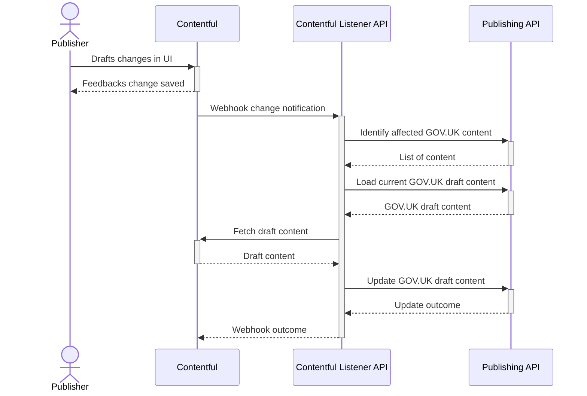
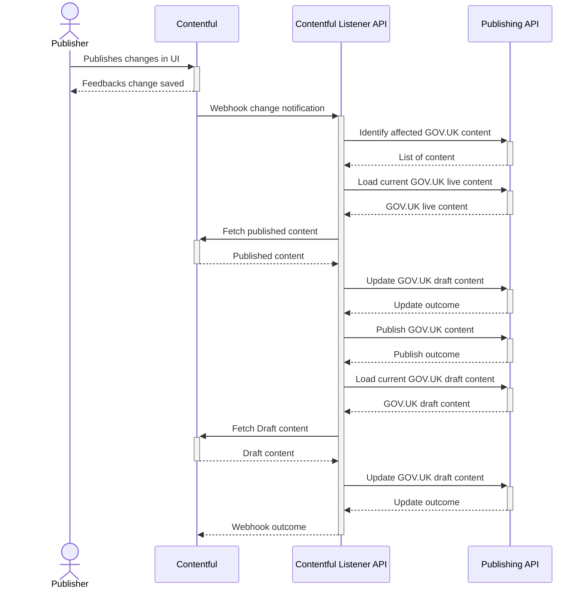

# How this application works

This tool acts as a relatively simple adapter between a [Contentful](https://www.contentful.com/) CMS instance and GOV.UK's [Publishing API]. It acts as a HTTP endpoint for [Contentful Webhooks](https://www.contentful.com/developers/docs/concepts/webhooks/) and uses this to initiate a process of updating GOV.UK content with data from Contentful.

Contentful relies upon a [link system between entries][contentful-entries] as a way to produce complex data structures. For this reason it is expected that a single page on GOV.UK, that is populated with Contentful data, will utilise a number of Contentful entries. Content will need to be updated on GOV.UK when any one of these entries are updated.

[publishing-api]: https://github.com/alphagov/publishing-api
[contentful-entries]: https://www.contentful.com/developers/docs/concepts/links/

## Updating draft content

The process to update draft GOV.UK content occurs whenever a publisher saves a change to the data stored in Contentful. When this occurs a webhook is triggered, this webhook will include information on the entity that was changed and how it was changed. For example, if a publisher updates a title field in Contentful then a webhook is triggered to describe the save event that altered the title.

This application, Contentful Listener API, is configured to receive webhooks from the Contentful instance. When it receives one it will query the GOV.UK Publishing API to determine if there are content items that utilise this entity and are thusly affected by the change the webhook is communicating. In most cases there will be one or zero items as it is not expected that Contentful entries will be used across multiple GOV.UK pages, however this is supported.

Contentful Listener API will then loop through any items it found in the Publishing API that are affected. For each one it will attempt to update the draft content of each of these.

The update process involves accessing the current content in the GOV.UK Publishing API. This allows recording a lock version number to utilise [Publishing API's optimistic locking][optimistic-locking], which is used to prevent concurrency problems, and determining whether the content actually requires an update - to avoid unnecessary work.

Once the Publishing API content is retrieved it will use the [Content Delivery API][content-delivery-api] to load the page data from Contentful. This involves first loading the entry that is configured in this application and then loading in all of the entries that are linked to this root entry. These entries are traversed to build a JSON representation, this will include all the fields of data from all the associated Contentful entries.

This Contentful data is assembled as a payload for the Publishing API. The current content is compared against this payload and, if the data is different, the Publishing API is updated with the new draft content, which it will use to update the GOV.UK draft stack.

Once all the content has been updated a summary of the work done will be returned in the webhook response.

[optimistic-locking]: https://github.com/alphagov/publishing-api/blob/main/docs/api.md#optimistic-locking-previous_version
[content-delivery-api]: https://www.contentful.com/developers/docs/concepts/apis/#content-delivery-api

## Updating live content

The process to update live GOV.UK content is very similar to the draft process, just with additional steps. This process occurs when a publisher makes a change in the Contentful user interface which affects published content. Examples of this could be publishing, archiving or deleting an entry.

When a webhook indicates that a change is made to live content, a process begins that attempts to update the live content on GOV.UK and, if necessary, reset the draft content afterwards.

In order to put live content on GOV.UK, it needs to exist on the Publishing API as a draft and this draft is promoted to being live. As GOV.UK content that is assembled from Contentful entries may contain a mixture of draft and published entries, it is necessary to first reset the draft content on GOV.UK to only contain published entries. Once this content is made live the draft GOV.UK content may no longer be in sync with the Contentful draft data. Therefore it is necessary to update the GOV.UK draft content with draft Contentful content after the content has been made live.
